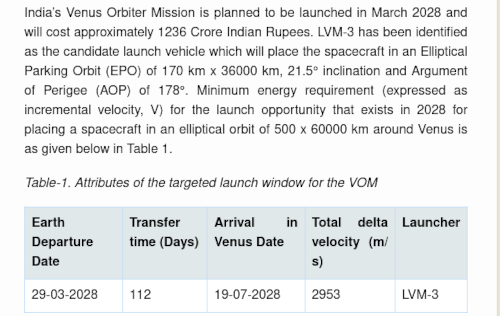
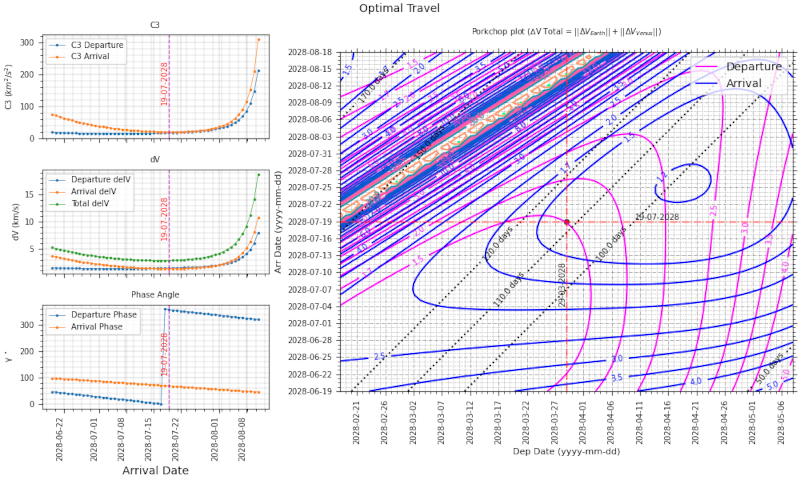

# Optimal Interplanetary transfer dV estimation
> Program to estimate nearest optimal arrival date and total dV for Type-I interplanetary trajectories using lambert's solver  

## Table of contents
* [Results](#Results)
* [General info](#general-info)
* [Setup](#setup)
* [How to run ](#how)
* [Updates](#updates)
* [To-do list](#to-do)


## Results   

Program tested against the known details of ISRO's Venus Orbiter Mission (VOM) as given in their website    
&nbsp;         
 
* [ https://www.isro.gov.in/UnionCabinetApprovesIndiasMission.html ]   
&nbsp;         
   

### Input :    

```
from_planet = 'earth'
to_planet   = 'venus'
start_date  = '30-03-2028'
```   

* Optimal Arrival date is calculated by selecting a set of days around hohmann tof day, and applying minimum of weighted mean average on c3, delta-v and phase angle data points.   
* Assumed an initial parking orbit of [170 X 36000] km at of departure planet and an arrival parking orbit of [500 X 60000] km at arrival planet.

### Output:      
### Porkchop plot near optimal arrival date   

```   
..................................................   
Hohmann TOF         : 144.80 days
Optimal TOF         : 112.00 days
Optimal arrival date: 19-07-2028
dVe at Earth    TOI : 1.504
dVe at Venus    TOI : 1.398
Total dVe           : 2.902
..................................................      
```
&nbsp;         

      


&nbsp;         

## General info
SPICE kernel 'de421.bsp' used for ephemeris estimation will be downloaded by Skyfield’s load() routine for the first time on the current directory.     
&nbsp;    
estimate planet1 [r1, v1, a1] and planet2 [r2, v2, a2] at start date     
departure from planet1 [r_dep, v_dep] = [r1, v1]    
estimate time of flight for hohmann transfer using a1 and a2     
estimate end date ( start date + time of flight)    
estimate planet1 [r1, v1, a1] and planet2 [r2, v2, a2] at end date    
arrival to planet2 [r_arr, v_arr] = [r2, v2]     
&nbsp;     
estimate orbit [v1, v2] using lamberts solver for the given position vectors and time of flight [r_dep, r_arr, tof].     
&nbsp;   
estimate v_inf (asymptotic velocity at infinite distance) for departure and arrival (subtract planet velocities)   
  v_inf_dep = |v_dep - v1| and  v_inf_arr = |v_arr - v2|    
  ∆V_total  = |Vplanet1(t1) − VT(t1)| + |Vplanet2(t2) − VT (t2)|    
  ∆V_total  = v_inf_dep + v_inf_arr     
&nbsp;    
estimate characteristic energy C3 (measure of the excess specific energy over that required to just barely escape from a massive body)    
  c3_dep = v_inf_dep<sup>2</sup>    
  c3_arr = v_inf_arr<sup>2</sup>    


&nbsp;    
## NOTE :   
SPICE kernel 'de421.bsp' [~18 MB] used for ephemeris estimation will be downloaded by Skyfield’s load() routine **once** on the current directory.  It will not connect to internet again on future runs.      


## Reference    

1.  Interplanetary Mission Design Handbook: Earth-to-Mars Mission Opportunities 2026 to 2045  
[ https://ntrs.nasa.gov/api/citations/20100037210/downloads/20100037210.pdf ]     

## Setup
Script is written with python (Version: 3.10.12) on linux. Additional modules required :   

* numpy  (tested with Version: 1.21.5 )
* skyfield  (tested with Version: 1.4.5 )

## How to run   
* Verify and install required modules 
* run `python ip_transfer.py`. 


## Updates   
*   
*   *  

## To-do list
* 

